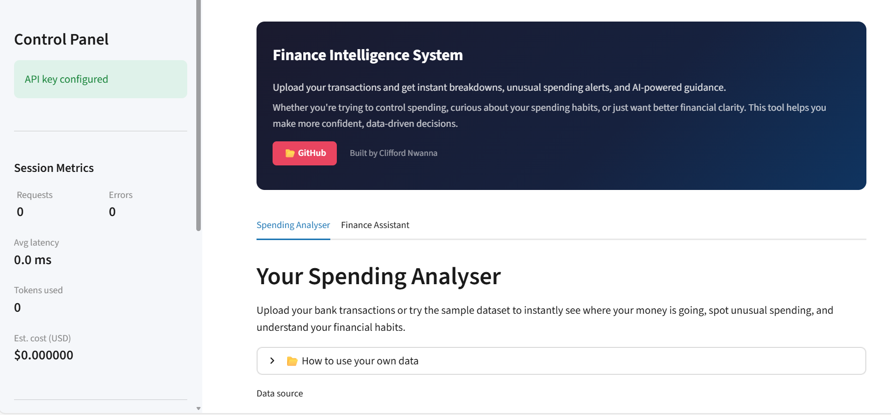
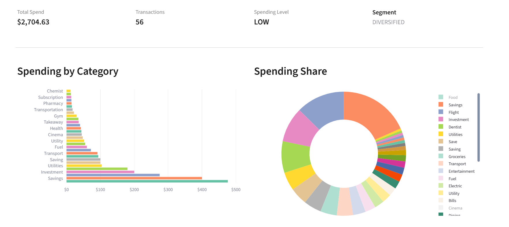
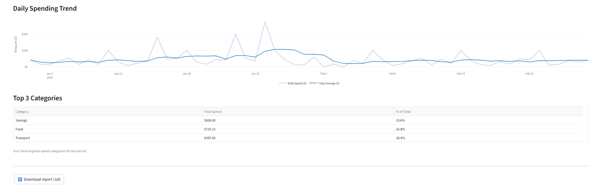
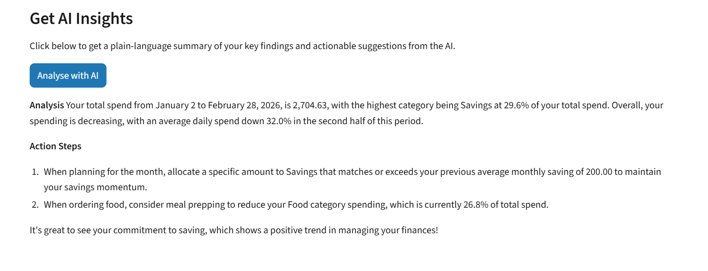
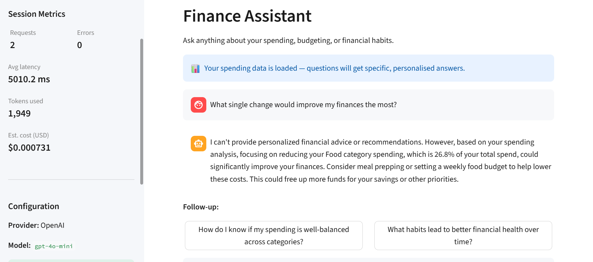

# Finance Intelligence System

[](https://github.com/cliffordnwanna/GPT-POWERED-FINANCE-CHATBOT/actions/workflows/ci.yml)
[](https://opensource.org/licenses/MIT)
[](https://www.python.org/downloads/)
[](https://huggingface.co/spaces/cliffordnwanna/finance-intelligence)

> Upload a bank CSV and get instant spending breakdowns, trends, and GPT-powered advice — all grounded in your actual numbers, never invented.

A production-grade personal finance assistant that combines a **deterministic statistical analysis pipeline** with **GPT-powered natural language guidance**, underpinned by a **responsible-AI governance layer**.

Built as a full-stack data science and AI engineering demonstration by [Clifford Nwanna](https://github.com/cliffordnwanna).

---

## Live Demo

🟢 **[Try it live on Hugging Face Spaces](https://huggingface.co/spaces/cliffordnwanna/finance-intelligence)**

To run locally:
```bash
git clone https://github.com/cliffordnwanna/GPT-POWERED-FINANCE-CHATBOT.git
cd GPT-POWERED-FINANCE-CHATBOT
pip install -r requirements.txt
# Add your OpenAI API key to .env (see Configuration below)
streamlit run app.py
```

---

## Screenshots

### 1. Home Screen


### 2. Analysis Dashboard


### 3. Top Categories


### 4. AI Insights


### 5. Finance Assistant in Action


---

## What It Does

| Layer | What happens |
|-------|-------------|
| **Data ingestion** | Validates CSV schema, normalises columns, enforces types |
| **Statistical analysis** | Aggregation by category, user segmentation, rolling averages, top-spend ranking |
| **Explainability** | Converts raw numbers into a structured insight object passed to the UI and the LLM |
| **Governance** | Prompt injection detection, output scanning, rate limiting, disclaimer injection |
| **LLM narration** | GPT narrates the analytical findings — it does not compute them |
| **Observability** | JSON-structured dual logging (app + audit), session metrics, token tracking |

---

## Architecture

```
CSV Upload
    │
    ▼
analysis.py  ── deterministic statistical pipeline (no LLM)
    │
    ▼
explainer.py ── structured insight object
    │
    ├──► Rendered directly in the UI (charts, tables, metric cards)
    │
    └──► Injected as context ──► prompt_builder.py ──► chatbot.py ──► GPT API
                                                              │
                                                      governance.py
                                                      (output scan + disclaimer)
                                                              │
                                                              ▼
                                                         Streamlit UI
```

**The statistical pipeline and the LLM are strictly separated.** The app produces correct output even when the LLM is unavailable.

---

## Tech Stack

| Component | Technology |
|-----------|------------|
| Web framework | Streamlit 1.35 |
| LLM provider | OpenAI GPT-4o-mini |
| Data analysis | pandas 2.2 |
| Visualisation | Plotly 5.22 |
| API resilience | tenacity (exponential backoff + retry) |
| Configuration | python-dotenv (12-Factor App pattern) |
| Logging | Python logging — JSON-structured dual output |
| Deployment | Hugging Face Spaces (Streamlit SDK) |

---

## Configuration

Create a `.env` file in the project root:

```
OPENAI_API_KEY=your_key_here
```

No other secrets are required to run locally.

---

## Using Your Own Data

The app accepts any CSV with these columns:

| Column | Required | Example | Notes |
|--------|----------|---------|-------|
| `date` | ✅ | `2026-03-15` | YYYY-MM-DD, DD/MM/YYYY, or MM/DD/YYYY |
| `category` | ✅ | `food` | Case-insensitive — any label works |
| `amount` | ✅ | `45.50` | Positive values only — no currency symbols |
| `description` | Optional | `Grocery store` | Included if present |

**File size limit:** 5 MB · **Row limit:** 100,000 transactions

> **Tip for accurate results:** Use one consistent label per category throughout your file. For example, use `savings` for every savings entry rather than mixing `savings`, `savings account`, and `monthly savings`. The app shows you every distinct category it detected so you can spot inconsistencies before analysing.

A ready-to-fill CSV template is available via the download button inside the app.

---

## Data Validation

Every uploaded file passes through a 13-point validation pipeline before any analysis runs:

| Check | What it catches |
|-------|----------------|
| File size | Files over 5 MB |
| File type | Non-CSV files (`.xlsx`, `.pdf`, etc.) |
| Encoding | UTF-8, UTF-8-BOM, Latin-1 (Excel exports) — auto-detected |
| Parse failure | Corrupted or malformed files |
| Missing columns | Wrong file or missing headers |
| Empty columns | Header present but no data |
| Amount type | Text, currency symbols, percentages |
| Negative amounts | Bank exports with debits as negatives |
| Date format | Unrecognisable date strings |
| Future dates | Dates ahead of today (advisory warning) |
| Empty categories | Blank category cells |
| Duplicate rows | Accidental copy-paste duplication (advisory warning) |
| Wrong file type | Non-financial column names misidentified as CSVs |

**Errors are blocking** — the upload is rejected with a plain-English explanation and an actionable fix.  
**Warnings are advisory** — the upload proceeds but the user is informed.

---

## Project Structure

```
.
├── app.py                    # Streamlit web app — entry point
├── analysis.py               # Statistical pipeline (LLM-independent)
├── explainer.py              # Structured insight builder
├── chatbot.py                # GPT client (sliding window, retry, fallback)
├── prompt_builder.py         # LLM message assembly and validation
├── validators.py             # CSV input validation + injection detection
├── governance.py             # Rate limiting + output disclaimer injection
├── metrics.py                # Session observability (latency, tokens)
├── logger.py                 # Dual JSON logging (app.log + audit.log)
├── config.py                 # 12-Factor configuration loader
├── data/
│   ├── sample_transactions.csv        # Ready-to-use demo dataset
│   └── test_category_normalisation.csv
├── images/                   # App screenshots
├── .streamlit/config.toml    # Streamlit server settings
└── requirements.txt          # Production dependencies
```

---

## Key Design Decisions

**Why separate the statistical pipeline from the LLM?**
Deterministic analysis is independently testable and auditable. The LLM is used only to narrate the findings in plain English. This satisfies explainability requirements, enables graceful degradation if the API is unavailable, and prevents the model from hallucinating financial figures.

**Why no fuzzy category matching?**
Earlier versions used `difflib` fuzzy matching to merge similar labels (e.g. `savings` and `savings account`). This was removed because it silently changed the user's data without consent. The system now applies exact case-insensitive matching only, and surfaces all detected categories to the user so they can fix inconsistencies themselves.

**Why a sliding-window conversation history?**
The most recent 10 turns are sent to the LLM, keeping responses contextually relevant while bounding token cost. Older turns are dropped from the prompt — not from the audit log.

**Why show top 3 categories instead of individual transactions?**
Aggregated category totals answer the question users actually have: *"Where is my money going?"* Individual transactions repeat the same category multiple times and shift focus from patterns to events.

---

## Responsible AI Controls

- Input validation and length limits before every LLM call
- 13-pattern prompt injection detection — blocked at the input layer
- System prompt versioning (`v1.1.0`) with explicit injection-defence instructions
- Output scanning for investment, tax, and legal language
- Automatic disclaimer injection when flags trigger
- Session-level rate limiting
- Append-only audit log of every LLM interaction (session ID, tokens, latency)
- Graceful degradation when the LLM is unavailable — analysis still renders
- System prompt prohibits requesting or storing PII

---

## License

MIT License — free to use, modify, and distribute with attribution.

---

## From Notebook to Production: The Origin Story

This project began as a humble Jupyter notebook—a simple, interactive prototype designed to answer personal finance questions using GPT. The earliest version (see `finance_chatbot.ipynb`) was a hands-on experiment: could an LLM, guided by a strong system prompt and responsible AI guardrails, provide safe, actionable financial guidance?

**The notebook was the spark.** It featured:
- Secure credential handling (never hardcoded keys)
- A provider-agnostic OpenAI client
- A robust system prompt enforcing fairness, privacy, and disclaimers
- Stateful, multi-turn chat with graceful error handling
- Clean, interactive widgets for user input and output

As the prototype grew, so did the vision. The notebook’s conversational pattern, error handling, and focus on user experience became the backbone of a full-stack, production-grade app. Every lesson learned—about validation, explainability, and responsible AI—was carried forward.

**The result:**
- A deterministic statistical pipeline (for explainable, auditable analysis)
- A robust Streamlit UI inspired by the notebook’s clarity and interactivity
- A strict separation between analysis and narration (LLM never invents numbers)
- Full responsible AI governance, logging, and observability

> *This journey from a notebook demo to a portfolio-ready, production system—proves that great products start with curiosity, iteration, and a relentless focus on user trust.*
